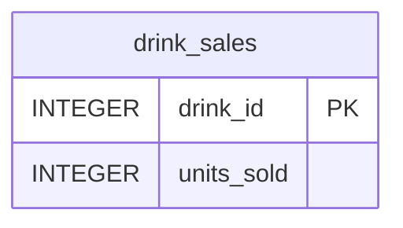

# Drink Sales Service


## Overview
The Drink Sales Service is a component of the Hotel Kong Arthur management system, responsible for tracking and managing beverage sales data. Built with Flask and SQLite, this microservice provides a RESTful API for monitoring drink sales and updating purchase quantities.

**Key Features:**
- Retrieve all drink sales data
- Update units sold for specific drinks
- Comprehensive error handling
- SQLite database integration
- Modular Flask architecture

## Project Structure
```bash
DrinkSalesService/
├── api/
│   └── drink_sales_routes.py        # API endpoints implementation
├── database/
│   ├── connection.py                # Database connection handler
│   ├── initialization.py            # Database setup and initialization
│   └── drinks_sales.db              # SQLite database
├── xlxs/
│   └── drinks_menu_with_sales.xlsx  # Initial data source
├── repositories/
│   └── drink_sales_repository.py    # Data access layer
├── app.py                           # Main application entry point
├── requirements.txt                 # Python dependencies
└── README.md                        # Project documentation
```

## Database Schema


## API Documentation
| Method | Endpoint | Description | Request Body | Response (200) | Error Responses |
|--------|----------|-------------|--------------|----------------|-----------------|
| GET | `/api/v1/drink_sales/purchase` | Get all drink sales | N/A | `[{"drink_id": 1, "units_sold": 150}]` | 404: `{"error": "No drink sales found"}` 500: `{"error": "Internal server error"}` |
| PATCH | `/api/v1/drink_sales/purchase/{drink_id}` | Update units sold | `{"amount_of_units_sold": 5}` | `{"message": "Units sold updated successfully"}` | 400: `{"error": "Invalid or missing 'amount_of_units_sold'"}` 500: `{"error": "Internal server error"}` |

## Installation & Setup
### Local Development
```bash
# Create and activate virtual environment
python3 -m venv .venv
source .venv/bin/activate

# Install dependencies
pip install -r requirements.txt

# Run the application
python3 app.py
```

## Testing
### Prerequisites
- Python 3.x
- Postman or similar API testing tool

### Example API Calls
1. **Get all drink sales**
   - **Method:** GET
   - **Request:** `http://127.0.0.1:5006/api/v1/drink_sales/purchase`
   - **Response Example:**
```json
[
    {
        "drink_id": 1,
        "units_sold": 150
    },
    {
        "drink_id": 2,
        "units_sold": 75
    }
]
```

2. **Update units sold**
   - **Method:** PATCH
   - **Request:** `http://127.0.0.1:5006/api/v1/drink_sales/purchase/1`
   - **Request Body:**
```json
{
    "amount_of_units_sold": 5
}
```
   - **Response Example:**
```json
{
    "message": "Units sold updated successfully"
}
```

---
#### Created by Hotel Kong Arthur Team
